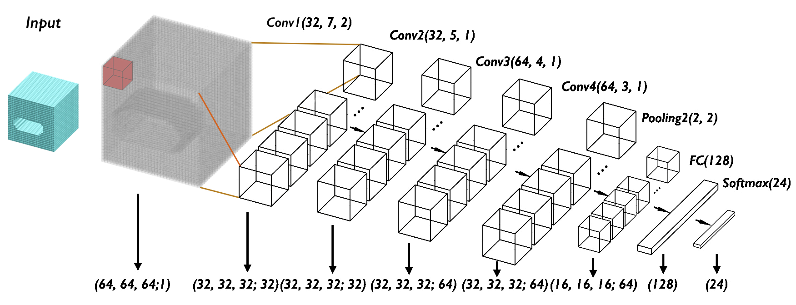

# FeatureNet
This is a re-implementation of FeatureNet in Tensorflow 2. FeatureNet is a deep learning architecture for machining feature recognition that utilises a voxel representation and 3D CNN.

The code is based on this original [paper](https://www.sciencedirect.com/science/article/abs/pii/S0010448518301349). This paper's original code can be found [here](https://github.com/zibozzb/FeatureNet) and dataset is available [here](https://github.com/madlabub/Machining-feature-dataset).

## Requirements
- Python > 3.8.5
- Tensorflow > 2.2.0
- Numpy > 1.19.1
- h5py > 1.10.6
- scipy > 1.5.2
- scikit-image > 0.17.2
- matplotlib > 3.3.2
- Binvox (Opensource software)

## Usage
### Dataset
- To create voxel models, CAD models be converted to **.stl** format. These must have the following naming convertion "{class_num}-{index_num}" e.g. 0-100.stl.
- The **binvox** .exe must be placed in the dataset directory with the stl files. A shell script is provided in */utils* to convert all the stls called **convert_to_voxel.sh**, this must also be placed in the directory. Below is an example of running the shell script for voxel models of resolution 64^3.

`bash ./convert_to_voxel.sh 64`

- An additional shell script **convert_to_voxel.sh** is also provided that will rotate the voxel model to create additional samples.
- The voxel models are split into training/validation/test subsets and batches are created then stored in h5df files. These h5df files are what are loaded during training and testing. This dataset split can be achieved by running **create_dataset_splits.py**.

### Training
- To train FeatureNet, alter the user parameters in the **training.py** as required and run.

### Testing
- To test a trained FeatureNet model for single machining features, alter the user parameters in **test.py** including the saved checkpoint found in */checkpoint* directory, then run the Python file.
- To segment a CAD model with multiple machining features using a trained FeatureNet model, alter the user parameters in **segmentation.py**. This is run on individual binvox files.

## Citation
    @article{featurenet2018,
      Author = {Zhibo Zhang, PrakharJaiswal, Rahul Rai},
      Journal = {Computer-Aided Design},
      Title = {FeatureNet: Machining feature recognition based on 3D Convolution Neural Network},
      Year = {2018}
    }

    @article{featurenettensorflow2,
      Author = {Andrew R Colligan},
      Title = {FeatureNet Tensorflow 2},
      Journal = {https://gitlab.com/qub_femg/machine-learning/featurenet-tensorflow-2},
      Year = {2021}
    }
    @article{Segmentation code from: https://github.com/PeizhiShi/MsvNet}

## Funding
Funding was provided by DfE.
